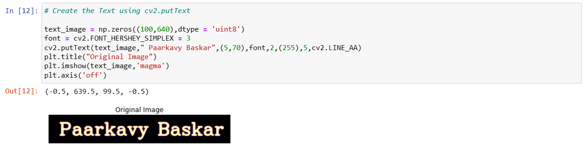
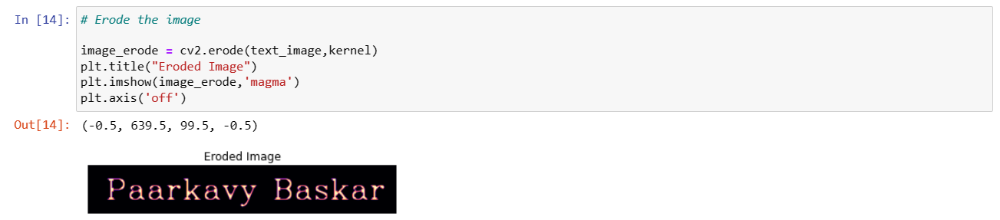
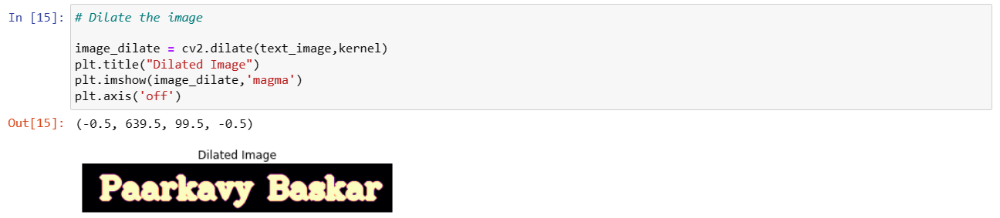

# IMPLEMENTATION OF EROSION AND DILATION
## AIM:
To implement Erosion and Dilation using Python and OpenCV.
## SOFTWARE REQUIRED:
1. Anaconda - Python 3.7
2. OpenCV
## ALGORITHM:
### STEP 1:
Import the necessary packages.

### STEP 2:
Create the text image using cv2.putText.

### STEP 3:
Then create the structuring image for dilation/erosion.

### STEP 4:
Apply erosion and dilation using cv2.erode and cv2.dilate.

### STEP 5:
Plot the images using plt.imshow.
 
## PROGRAM:
```
/*
NAME : Paarkavy B
REG.NO:212221230072
*/
```

```
# Import the necessary packages
import cv2
import numpy as np
import matplotlib.pyplot as plt

# Create the Text using cv2.putText
text_image = np.zeros((100,640),dtype = 'uint8')
font = cv2.FONT_HERSHEY_SIMPLEX = 3
cv2.putText(text_image," Paarkavy Baskar",(5,70),font,2,(255),5,cv2.LINE_AA)
plt.title("Original Image")
plt.imshow(text_image,'magma')
plt.axis('off')

# Create the structuring element
kernel = cv2.getStructuringElement(cv2.MORPH_CROSS,(7,7))

# Erode the image
image_erode = cv2.erode(text_image,kernel)
plt.title("Eroded Image")
plt.imshow(image_erode,'magma')
plt.axis('off')

# Dilate the image
image_dilate = cv2.dilate(text_image,kernel)
plt.title("Dilated Image")
plt.imshow(image_dilate,'magma')
plt.axis('off')
```

## OUTPUT:

### DISPLAY THE INPUT IMAGE


### DISPLAY THE ERODED IMAGE


### DISPLAY THE DILATED IMAGE


## RESULT:
Thus the generated text image is eroded and dilated using python and OpenCV.